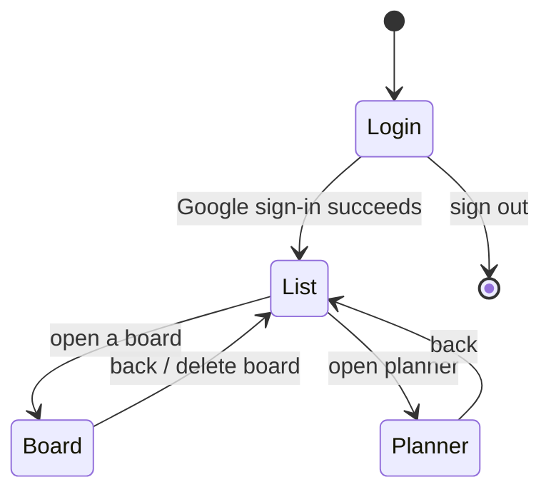

# Kboard — App Flow

Screen-by-screen specification of states, navigation and edge cases.
Companion to [TRD](./TRD.md); product intent lives in the [PRD](./PRD.md).

---

## 1. Navigation model

There is no router. `App.tsx` holds a single `view` state:

```ts
type View = "list" | "board" | "planner";
```

`view` is kept in sync with `board.activeBoard` — opening a board sets both,
and "back" clears both.



**Only URL parameter:** `?share=<id>` — consumed once on load by
`getShareIdFromUrl()` + `take()`, then removed.

---

## 2. Startup sequence

```
App mounts
  ├─ useAuth hydrates profile from localStorage (instant, offline-safe)
  ├─ useBoard hydrates boards cache from localStorage   → boards list renders
  └─ If profile exists AND a valid token exists
        └─ Background: revalidate boards from Drive (non-blocking)
```

The critical property: **the boards list renders before any network call
completes.** A user with no connectivity sees their last-seen boards
immediately, and Drive reconciles when it can.

---

## 3. Screen: Login

**Component:** `components/LoginScreen.tsx`

### States

| State | Rendering |
|---|---|
| Default | Product name, description, "Sign in with Google" button with the official four-colour Google mark |
| Authenticating | Button disabled while the token request is in flight |
| Error | Message above the button |

### Flow

1. User clicks **Sign in with Google**.
2. `requestAccessToken("")` requests a silent grant; if Google has no prior
   grant the consent UI appears.
3. On success the profile is fetched from `userinfo` and cached.
4. `view` → `"list"`.

### Edge cases

- **Existing token, new tab** — the profile is read from `localStorage`, so the
  user goes straight to the boards list with no redirect.
- **Token present but scope insufficient** — `reauthenticate()` forces
  `prompt: "consent"`.
- **Popup blocked** — documented in the README; requires the user to allow
  popups for the origin.

---

## 4. Screen: Boards list

**Component:** `components/BoardListView.tsx`

### States

| State | Rendering |
|---|---|
| Loading (first ever run) | Spinner |
| Empty | Call to action: create your first board |
| Populated | Card grid, newest first |
| Offline | Populated from cache; a subtle indicator explains data may be stale |
| Deleting | Confirmation dialog on the delete action |

### Card anatomy

Each card shows the board name, `{cardCount} cards · {columnCount} columns`,
and hover/focus-revealed actions.

### Actions

| Action | Result |
|---|---|
| Click a card | `openBoard(id)` → `view = "board"` |
| Create board | Prompt for a name → creates `To do` / `In progress` / `Done`, the last marked as a done column → opens it |
| Delete board | `confirm()` → Drive `DELETE` → removes from cache |

### Edge cases

- **Drive unreachable** — the cached list still renders; a banner explains
  changes cannot be saved right now.
- **Delete while offline** — the file cannot be removed. The UI reports the
  failure rather than optimistically removing it.

---

## 5. Screen: Board

**Component:** `components/BoardView.tsx`

Two distinct layouts render from one tree, chosen by `useViewport()`.

### 5.1 Desktop / tablet (≥ 768 px)

```
┌──────────────────────────────────────────────────────┐
│ TopBar:  ☰  📋 Kboard  / Board name    Planner  User │
├────────┬─────────────────────────────────────────────┤
│        │ Board header: name · N cards · Delete · ⌨   │
│Sidebar ├─────────────────────────────────────────────┤
│        │ ┌────────┐ ┌────────┐ ┌────────┐            │
│ Boards │ │ To do  │ │ Doing  │ │ Done   │  + Add col │
│ Labels │ │ ┌────┐ │ │ ┌────┐ │ │ ┌────┐ │            │
│ Planner│ │ │card│ │ │ │card│ │ │ │card│ │            │
│        │ │ └────┘ │ │ └────┘ │ │ └────┘ │            │
└────────┴─────────────────────────────────────────────┘
```

- Sidebar fully expanded; columns side-by-side; the board scrolls
  horizontally.
- `.btn--ghost` on the accent topbar uses `--color-on-accent`.

### 5.2 Mobile (< 768 px)

```
┌────────────────────────────┐
│ TopBar (safe-area aware)   │
├────┬───────────────────────┤
│ ↑  │  To do            (3) │  ← active column
│ ↓  │  ┌─────────────────┐  │
│Boa │  │      card       │  │
│Pla │  └─────────────────┘  │
│    │      card             │
└────┴───────────────────────┘
```

- The sidebar collapses to a **56 px icon rail**; the topbar hamburger
  expands it over the content with a backdrop.
- The board becomes a **vertical column rail**: each column is a strip with
  its name written vertically and its card count at the bottom. Tapping a
  strip expands that column into the content area — **one column visible at a
  time**.

### 5.3 Board header

Contains the editable board name, the `{cards} · {columns}` counter, a
**Delete board** button, and the **keyboard shortcuts** disclosure added in
Sprint 3.

### 5.4 Card anatomy

```
┌────────────────────────────────┐
│▎ Story              ⋮          │  ← type stripe (3 px, type colour)
│  Fix login redirect             │  ← title
│  🏷 bug  🏷 auth      📅 12 Oct  │  ← labels, date badge
│  ☐ 2/5  👤 3  💬 2              │  ← checklist, subtasks, comments
└────────────────────────────────┘
```

### 5.5 Drag-and-drop flows

**Desktop (pointer)**

1. Pointer down on a card.
2. Movement exceeds **5 px** → the drag activates.
3. The card follows the cursor; drop targets highlight.
4. Release → the card is moved; the change is logged and the save is debounced
   600 ms.

Below 5 px the press is treated as a click, which opens the editor. This is why
the activation constraint exists.

**Mobile (touch)**

1. Touch and hold for **250 ms** (8 px tolerance) → the drag activates.
2. Because only one column is visible, a **column-target overlay** appears,
   listing every column.
3. Dropping anywhere on a target moves the card to that column.
4. A short tap (< 250 ms) opens the card instead.

**Keyboard (WCAG 2.1.1)**

1. Focus a card, press <kbd>Space</kbd> → it is picked up.
2. Arrow keys move it between positions and columns.
3. <kbd>Space</kbd> drops it; <kbd>Escape</kbd> cancels and returns it.

The in-app shortcuts panel documents exactly these bindings, and a test asserts
a card really can be moved this way so the documentation cannot drift.

### 5.6 Edge cases

| Case | Behaviour |
|---|---|
| Column deleted while a card is selected | Selection cleared |
| Board deleted from another tab | Revalidation replaces the cache; the board is no longer listed |
| Drive conflict (412) | Banner with a recovery action; local edits are not silently lost |
| Offline drag | Applied locally; the save is deferred and retried |

---

## 6. Screen: Card editor (modal)

**Component:** `components/CardEditor.tsx` — a `Modal` that becomes a
**bottom sheet** on mobile.

### Anatomy

```
┌───────────────────────────────────────┐
│ Story ×                               │  ← type chip + close
├───────────────────────────────────────┤
│ Fix login redirect                    │  ← title input
│ [Epic ▾] [ + Add child ] [ + parent ] │
│ Start [date]  Due [date]              │
│ 🏷 + Add label                        │
│ ── Description ──                    │
│ [Tiptap: B I H2 • list quote code]    │
│                                       │
│ ── Fields (board-level) ──            │
│ [Story points  5]                     │
│ ── Fields (Story-type) ──             │
│ [Acceptance criteria …]               │
│ ── Checklists ──                      │
│ ☐ Preload bundle                      │
│ ── Children ──  ┌──────────────────┐  │
│   #42 Write tests │  │               │  │
│ ── Activity ──                       │
│ ── Comments ──                       │
├───────────────────────────────────────┤
│ [Discard]              [Save]         │
└───────────────────────────────────────┘
```

### Save / discard

- **Save** commits local state, writes a Drive entry, clears the draft.
- **Discard** prompts if there are unsaved edits, then **tombstones** the draft
  so a reopen starts clean.

### Draft preservation

Edits to title and description are mirrored to `localStorage` as you type.
Navigating to another card (via a parent chip, a child row or "+ Add child")
**keeps** the current draft and restores it when you return. Reloading the
page mid-edit also restores it.

This is the single most requested behaviour in practice: losing a paragraph to
an accidental navigation is the failure mode users remember.

### Create-child / create-parent

`+ Add child` opens a new card pre-linked to the current one, with focus on
the title. Discarding the new card leaves the parent untouched — an undo, not
a half-created entity.

### Column picker

A combobox that auto-selects the card's current column and lists the others in
board order. Changing it moves the card when you save.

### Modal behaviour

- <kbd>Escape</kbd> closes (with a confirm if there are unsaved edits).
- Clicking the backdrop closes.
- On mobile it is a full-height bottom sheet respecting
  `env(safe-area-inset-*)`.

---

## 7. Screen: Planner

**Component:** `views/PlannerView.tsx`

A 7-day week view of every dated card **across all boards**.

```
┌──────────────────────────────────────────┐
│ ‹  Sep 29 – Oct 5  ›            Hoje     │
├──────────────────────────────────────────┤
│ Mon 29  │ Tue 30 │ Wed 1 │ Thu 2 │ …    │
│ ┌─────┐ │ ┌─────┐│       │        │      │
│ │card │ │ │card ││       │        │      │
│ └─────┘ │ └─────┘│       │        │      │
├──────────────────────────────────────────┤
│ ▸ No due date (4)                        │
└──────────────────────────────────────────┘
```

- **Drag a card to another day** to reschedule. Uses `PlannerDndContext` with
  day droppables (`day:YYYY-MM-DD`); the drop calls `updateCard({ dueDate })`.
- Undated cards are collapsed into a disclosure at the bottom.
- Keyboard drag-and-drop is supported here too, and the shortcuts panel is in
  the planner header.

---

## 8. Global overlays

| Overlay | Trigger | Dismissal |
|---|---|---|
| **Banner** (error / success / info) | Any async failure or recovery | Auto-dismiss for success; manual for errors |
| **Update toast** | A new service worker is waiting | Click **Reload**; persists until then |
| **Install prompt** | `beforeinstallprompt` (Chrome/Edge/Android) or iOS detection | Dismiss; remembered 7 days |
| **Sync-conflict banner** | Drive `412` | Explicit user action |
| **Confirmation dialog** | Destructive actions | Cancel or confirm |

**Update behaviour is deliberately prompt-not-auto.** `skipWaiting: false`
means a new version waits until the user chooses, so an in-progress card edit
is never destroyed by a surprise reload.

---

## 9. Accessibility flows

### 9.1 Skip link

Press <kbd>Tab</kbd> from the top of any view → **Skip to main content** is
the first stop. Activating it moves focus to `<main id="main-content">`
(`tabIndex={-1}`), bypassing the topbar and the whole sidebar.

> Implementation note: the link is visually hidden with the clip technique and
> **no negative margin**. Both `top: -100%` and the conventional
> `margin: -1px` put the 1×1 box outside the viewport, which makes Chromium
> drop it from sequential focus navigation while programmatic `.focus()`
> still works — so the bug is invisible to a naive test and fatal in practice.

### 9.2 Keyboard-only board navigation

Every action is reachable without a pointer: open a board, move a card, edit
fields, add comments, delete a column.

### 9.3 Focus visibility

Global `:focus-visible` applies a two-tone ring. Elements with a transparent
background and border — notably the mobile column rail strips — carry an
**explicit** outline, because a `box-shadow` ring on transparency is
effectively invisible against the dark rail.

### 9.4 Touch targets

44 px minimum for buttons, inputs and rich-text toolbar buttons, applied under
`@media (pointer: coarse)` so the denser desktop layout is unaffected.

---

## 10. State transitions at a glance

| Event | Local state | Drive | UI |
|---|---|---|---|
| Edit a card field | Updated immediately | Debounced save (600 ms) | No spinner |
| Navigate between cards | Draft saved to `localStorage` | — | Edits preserved |
| Click a card | — | — | Modal opens |
| Save | Committed | `PATCH` + ETag | Draft cleared |
| Drag a card | Moved | Debounced save | Activity entry added |
| Go offline | Fully usable | Writes deferred | Stale-data indicator |
| Come back online | — | Deferred writes flush | Indicator clears |
| Second tab edits | — | `412` on next write | Conflict banner |

---

## 11. Related documents

- [PRD](./PRD.md) — what the product is for
- [TRD](./TRD.md) — how it is built
- [UX/UI Design](./UX-UI-DESIGN.md) — visual specification
