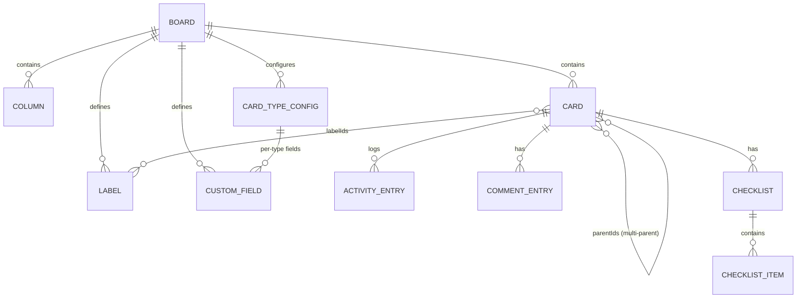

# Kboard — Data Model & Storage Schema

How Kboard stores data. There is **no SQL database and no backend** — the
"database" is a set of JSON documents in the user's Google Drive
`appDataFolder`, plus browser-local caches.

Source of truth: `src/models/types.ts` (types),
`src/models/migrations.ts` (normalization), `src/drive/boardRepository.ts`
(Drive mapping).

---

## 1. Storage tiers

| Tier | Medium | Lifetime | Purpose |
|---|---|---|---|
| **Authoritative** | Google Drive `appDataFolder` | Permanent | The boards |
| **Session cache** | `localStorage` | Until logout | Offline rendering |
| **Transient** | React state | Tab lifetime | Live editing |
| **Ephemeral** | IndexedDB | Until consumed | Inbound web shares |

The rule: **Drive is the source of truth; everything else is a cache.** A
cache entry is never required to open a board.

---

## 2. Drive layout

```
User's Drive
└── appDataFolder/                 ← hidden, app-scoped, per-user
    ├── board-3f8a1c2e-….json      ← one file per board
    ├── board-9b2d4e7a-….json
    └── …
```

### 2.1 File properties

| Property | Value | Purpose |
|---|---|---|
| `name` | `board-<boardId>.json` | Recognisable in Drive's UI |
| `parents` | `["appDataFolder"]` | Hidden app space |
| `mimeType` | `application/json` | Native preview |
| `appProperties.kind` | `kboard.board.v1` | **Type marker — the filter** |
| `appProperties.boardId` | Board id | Denormalised |
| `appProperties.boardName` | Board name | Denormalised for the list view |

`boardId` and `boardName` are denormalised so the boards list renders from
`files.list` alone, **without downloading every board's content**.

`kind` is versioned (`v1`) deliberately, leaving room for a future
`kboard.board.v2` without ambiguity.

### 2.2 API operations

| Operation | Method | Endpoint |
|---|---|---|
| List | GET | `/drive/v3/files?spaces=appDataFolder&fields=files(id,name,modifiedTime,version,appProperties)&pageSize=200` |
| Read | GET | `/drive/v3/files/{id}?alt=media` |
| Create | POST | `/upload/drive/v3/files?uploadType=multipart` |
| Update | PATCH | `/upload/drive/v3/files/{id}?uploadType=media` |
| Delete | DELETE | `/drive/v3/files/{id}` |

### 2.3 Concurrency

`board.driveVersion` stores the ETag returned by the last successful write.
On update, a `412 Precondition Failed` means another editor won the race. The
app re-reads the winner's version and surfaces a recovery banner rather than
overwriting.

---

## 3. Entity model



### 3.1 Cardinality summary

| Relationship | Cardinality | Implementation |
|---|---|---|
| Board → Columns | 1:N | `columns: Column[]` |
| Board → Cards | 1:N | `cards: Record<string, Card>` (map, not array) |
| Card → Column | N:1 | Column holds `cardIds[]`; **the column is authoritative for order** |
| Card ↔ Card | N:M | `card.parentIds: string[]` (**multi-parent**) |
| Card → Labels | N:M | `card.labelIds: string[]` |
| Card → Activity | 1:N | Append-only |
| Card → Comments | 1:N | Oldest-first |
| Card → Checklists | 1:N | Items are flat |

---

## 4. Schema

### 4.1 `Board`

```jsonc
{
  "id": "3f8a1c2e-…",              // string, uuid
  "name": "Q3 Roadmap",
  "labels": [ /* Label */ ],
  "customFields": [ /* CustomField */ ],   // board-level
  "cardTypes": [ /* CardTypeConfig */ ],
  "doneColumnIds": ["col-done"],   // drives progress rollup  "savedViews": [ /* SavedView */ ],  // optional; [] when absent  "columns": [ /* Column */ ],
  "cards": { "card-id": { /* Card */ } },
  "createdAt": 1727000000000,      // epoch ms
  "updatedAt": 1727500000000,
  "driveFileId": "1AbC…",          // set after first save
  "driveVersion": "\"1AbC…\""      // ETag
}
```

### 4.2 `Column`

```jsonc
{
  "id": "col-todo",
  "name": "To do",
  "cardIds": ["card-a", "card-b"]  // ORDER IS HERE
}
```

> **Design note.** Card order lives on the *column*, not the card. This makes
> "move a card to a position" a single-string operation on one array, and
> makes it impossible for a card to exist in two columns at once — a real bug
> class in card-based orderings.

### 4.3 `Card`

```jsonc
{
  "id": "card-a",
  "type": "task",                  // epic | story | task
  "title": "Fix login redirect",
  "descriptionHtml": "<p>…</p>",   // Tiptap, sanitized by DOMPurify
  "labelIds": ["lbl-bug"],
  "parentIds": ["story-1"],        // multi-parent; [] = top level
  "startDate": "2026-09-29",       // ISO YYYY-MM-DD or null
  "dueDate": "2026-10-12",         // ISO YYYY-MM-DD or null
  "activity": [ /* ActivityEntry */ ],
  "comments": [ /* CommentEntry */ ],
  "checklists": [ /* Checklist */ ],
  "boardFieldValues": { "fld-points": 5 },   // board-level field values
  "typeFieldValues": { "fld-criteria": "…" }, // per-type field values
  "createdAt": 1727000000000,
  "updatedAt": 1727500000000
}
```

**Why two field-value maps?** A card needs values for both the board's shared
fields *and* the fields belonging to its own type. Splitting them means a type
can be changed without silently losing data, and the UI can render "Fields"
and "Task fields" as separate sections.

### 4.4 `Label`

```jsonc
{ "id": "lbl-bug", "name": "Bug", "color": "#d03a3a" }
```

`color` is a hex from the curated 12-colour palette. `pickForeground` computes
the text colour at render time, so a label is readable regardless of hue.

### 4.5 `CustomField`

```jsonc
{
  "id": "fld-points",
  "name": "Story points",
  "type": "number",                // see table below
  "unit": "pts",                   // number only
  "decimals": 0,                   // number / percentage only
  "options": [                     // preset_list only
    { "id": "opt-1", "name": "Active", "color": "#61bd4f" }
  ]
}
```

| `type` | Stored value | Notes |
|---|---|---|
| `short_text` | `string` | Single line |
| `long_text` | `string` | Multi-line |
| `number` | `number` | Optional `unit`, `decimals` |
| `percentage` | `number` | Optional `decimals` |
| `boolean` | `boolean` | Checkbox |
| `date` | `string` | ISO `YYYY-MM-DD` |
| `preset_list` | `string` | Stores `option.id`, not the label |

A `Card` stores field values as
`Record<string, string | number | boolean>` keyed by `CustomField.id`. Defining
the field and storing its value are **separate documents**, so adding a field
to a board does not require rewriting every card.

### 4.6 `CardTypeConfig`

```jsonc
{
  "type": "story",
  "enabled": true,
  "label": "Story",                // user-overridable display label
  "customFields": [ /* CustomField */ ]   // per-type, separate from board-level
}
```

Hierarchy rules live in `CARD_TYPE_META`, not in the data:

| Type | Icon | Can have parent | Can have children | Shows progress |
|---|---|---|---|---|
| Epic | ◆ | — | Story | ✅ |
| Story | ★ | Epic | Task | ✅ |
| Task | ● | Story | — | ❌ |

### 4.7 `ActivityEntry`

```jsonc
{
  "id": "act-1",
  "kind": "moved",                 // 16 kinds, see below
  "text": "Moved to 'In progress'",
  "at": 1727500000000
}
```

Append-only, system-generated. The 16 kinds: `created`,
`title_changed`, `description_changed`, `type_changed`, `labels_changed`,
`parents_changed`, `start_date_changed`, `due_date_changed`, `moved`,
`comment_added`, `checklist_added`, `checklist_renamed`, `checklist_deleted`,
`checklist_item_added`, `checklist_item_renamed`, `checklist_item_toggled`,
`checklist_item_deleted`.

### 4.8 `CommentEntry`

```jsonc
{
  "id": "cmt-1",
  "author": "Sam Rivera",
  "authorPicture": "https://…",   // optional
  "body": "Looks good to me",
  "at": 1727500000000
}
```

### 4.9 `Checklist`

```jsonc
{
  "id": "chk-1",
  "title": "Frontend",
  "items": [ { "id": "itm-1", "text": "Preload bundle", "done": false } ]
}
```

**One nesting level by design.** Items have no children in v1; nested
sub-items are an explicit non-goal.

### 4.10 `SavedView`

A named filter preset, scoped to ONE board.

```jsonc
{
  "id": "view-1",
  "name": "Urgent bugs",       // unique per board, case-insensitive, trimmed
  "filter": { /* FilterState */ },
  "createdAt": 1727000000000,
  "updatedAt": 1727500000000
}
```

**Board-scoped by design — there are no global views.** Every id inside
`filter` (`labelIds`, `columnIds`, `fieldId`, `optionIds`) refers to an entity
owned by the same board, so nothing needs cross-board id resolution. A
global-view design would require a migration plus remapping every stored
filter.

Note there is **no `searchQuery`** on a view: a view stores a filter only.
Persisting a search term would make a recalled view silently hide most of the
board.

### 4.11 `FilterState`

A structured, persistable board filter. **Every property is optional and every
array defaults to empty, so an empty `FilterState` means "no filtering"** —
that invariant is what makes "Clear all" a single assignment.

| Property | Type | Semantics |
|---|---|---|
| `cardTypes` | `CardType[]` | OR within |
| `labelIds` | `string[]` | OR within |
| `columnIds` | `string[]` | OR within |
| `fieldFilters` | `FieldFilter[]` | OR within, AND across |
| `startDate` | `DateFilter` | AND with `dueDate` |
| `dueDate` | `DateFilter` | |
| `done` | `"done" \| "not-done"` | tri-state; absent = any |

Predicates AND across properties. A label filter uses **AND** semantics: a card
must carry *every* selected label.

**Deliberately absent: title, description, comments.** Those are searchable
but not filterable, and omitting the keys makes that structurally impossible
rather than a rule to remember. Text custom fields are likewise not filterable;
`preset_list` fields are (that is what backs "Priority").

An unknown `fieldId` — or a field whose `type` is not one of the seven
`FieldType` values — is treated as **inert**: it matches rather than excluding
everything. Labels and fields get deleted; a stale filter must not blank the
board.

### 4.12 `UserProfile`

```jsonc
{ "id": "…", "name": "…", "email": "…", "picture": "https://…" }
```

Not persisted to Drive — cached in `localStorage` only.

---

## 5. Browser-local storage

| Key | Shape | Cleared on logout |
|---|---|---|
| `kboard:google-token` | `{ accessToken, expiresAt }` | ✅ |
| `kboard:google-profile` | `UserProfile` | ✅ |
| `kboard:boards-cache` | Board list + last-saved board content | ✅ |
| `kboard:boards-cache-meta` | `{ [boardId]: { lastCheckedAt } }` | ✅ |
| `kboard:card-drafts` | `{ [cardId]: CardDraft }` | ✅ |
| `kboard:install-dismissed` | Epoch ms | ❌ (7-day TTL) |

### 5.1 `CardDraft`

```jsonc
{
  "title": "…",
  "descriptionHtml": "…",
  "updatedAt": 1727500000000,
  "discarded": false    // true = tombstone
}
```

Drafts are a **hint, not a commit** — the board remains the source of truth.
A tombstone (`discarded: true`) makes `get` return `null` while keeping the
entry so a later `clear` can remove it.

### 5.2 IndexedDB — share inbox

Database `kboard-share` (v1), object store `pending`, keyPath `id`:

```jsonc
{ "id": "random-id", "payload": { "title": "…", "text": "…", "url": "…", "ts": 1727500000000 } }
```

IndexedDB rather than `localStorage` because the payload arrives via
`share-capture.html` → `/?share=<id>` redirect, and must survive that
navigation. The record is deleted once taken (single-use).

---

## 6. Normalization (schema versioning)

There is **no explicit version field**. `normalizeBoard(raw: unknown): Board`
coerces any historical or malformed input into a valid `Board`.

### 6.1 Rules

| Input | Output |
|---|---|
| `labels` not an array | `[]` |
| Malformed label entries | filtered out |
| `cardTypes` missing / unknown types | defaults for all three |
| `cardTypes[].label` blank | `CARD_TYPE_META[type].defaultLabel` |
| `doneColumnIds` missing | columns named `done` (case-insensitive) |
| `columns[].cardIds` not an array | `[]` |
| `Card.type` missing | `"task"` |
| `customFieldValues` (legacy key) | migrated to `boardFieldValues` |
| `savedViews` missing / not an array | `[]` |
| `savedViews[]` entry missing `id`, `name` or `filter` | entry dropped |
| `savedViews[]` blank `name` | entry dropped |
| duplicate `savedViews` name or `id` | first wins, rest dropped |
| Malformed JSON | empty board, **not** an exception |
| `id` / `createdAt` / `updatedAt` missing | generated / `Date.now()` |

### 6.2 Design principle

**A board must never fail to open because a field is missing.** Corrupt or
partial data degrades to a usable board rather than a crash. A future
breaking change would add a version marker and branch inside
`normalizeBoard`.

---

## 7. Integrity rules

| Rule | Enforced by | On violation |
|---|---|---|
| Epic cannot have a parent | `relations.ts` | Link rejected |
| Story parent must be an Epic | `relations.ts` | Link rejected |
| Task parent must be a Story | `relations.ts` | Link rejected |
| No cycles | `relations.ts` | Link rejected |
| A card appears in exactly one column | Column holds `cardIds` | Structurally impossible |
| All data is JSON-serializable | Type system | Compile error |
| HTML is sanitized | DOMPurify, on **write** | Tags stripped |

> HTML is sanitized **before persistence**, not only before render. An
> untrusted board file must not be able to inject markup into the editor.

---

## 8. Derived data (not stored)

Computed on read, never persisted:

| Value | Function | Rule |
|---|---|---|
| Card progress | `computeProgress(card, board)` | Task → `{0,0,null}`. Story → direct child tasks. Epic → direct child stories **+ their tasks** (transitive). `percent = round(done/total × 100)`, `null` when `total === 0`. |
| Card column | `buildColumnIndex(board)` | Reverse index from `cardIds` |
| Card is done | `isCardInDoneColumn` | Column ∈ `doneColumnIds` |
| Counts by type | `countByType` | Grouped for the sidebar |
| Search haystack | `searchHaystack` (internal) | title + tag-stripped description + label **names** + type **label** |
| Visible cards | `visibleCardIds` | Search AND filter; `null` when neither narrows (render fast path) |

Storing these would create a denormalisation that can drift. They are cheap to
compute and derived deterministically instead.

> **Search and filter state are session-only.** The active query and the active
> filter live in `src/state/viewState.tsx`, never in the board file. Only an
> explicitly saved *view* is persisted (see §4.10). This is deliberate: baking a
> transient view into the authoritative document would be a bug class of its
> own, and it would make the file differ from the data the user last edited.

---

## 9. Sync timing

| Constant | Value | Effect |
|---|---|---|
| `DEBOUNCE_MS` | `600` | Coalesces rapid edits into one Drive write |
| `REVALIDATE_TTL_MS` | `60_000` | At most one background re-read per board per minute |

The revalidation TTL is stamped **before** the request, so two tabs opening the
same board coalesce into one API call rather than two.

---

## 10. Scale characteristics

| Concern | Current design | Limit |
|---|---|---|
| Board size | One file, full replacement | A few hundred KB; fine into the low thousands of cards |
| Write cost | Whole-file `PATCH` | Write amplification; revisit past ~2000 cards |
| List cost | One `files.list`, no content download | Constant |
| Offline | Full read/write; writes deferred and retried until Drive confirms them | Bounded by localStorage quota (~5 MB) |
| Concurrent editors | Last-write-wins with `412` detection | One edit can be lost; surfaced, not silent |

---

## 11. Related documents

- [PRD](./PRD.md)
- [TRD](./TRD.md) — architecture and API detail
- [App Flow](./APP-FLOW.md)
- [UX/UI Design](./UX-UI-DESIGN.md)
